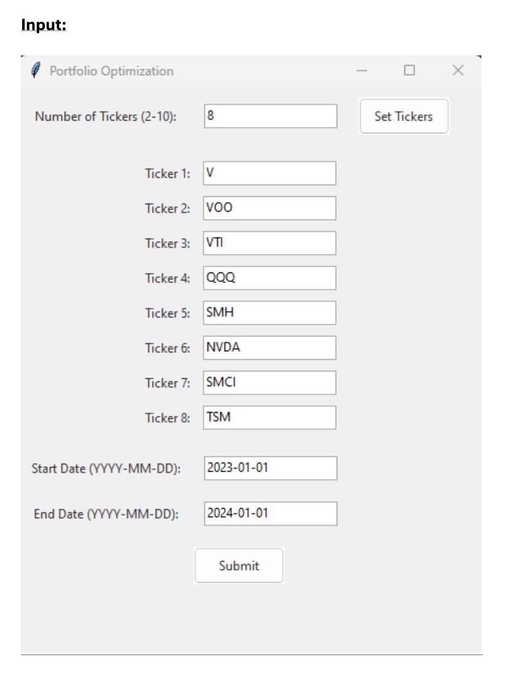
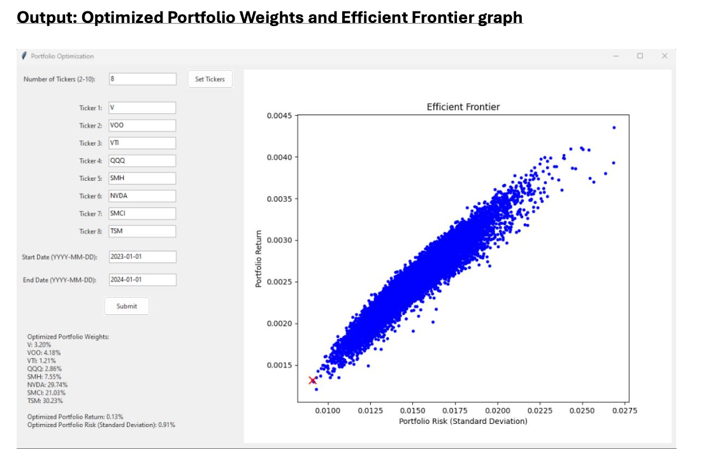

# Portfolio Optimizer App 📈

The **Portfolio Optimizer App** is an intuitive and user-friendly tool designed to help investors optimize their stock portfolios by effectively balancing risk and return. It empowers users to manage risk and maximize returns by leveraging advanced financial modeling techniques.

## Risk Management

The app assists users in identifying portfolio weightings that offer the lowest possible risk for a given set of assets. This capability is crucial for preserving capital, especially in volatile market conditions.

## How It Works

1. **User Input:**  
   The user selects a set of stock tickers and specifies a date range for historical data.

2. **Data Retrieval:**  
   The app fetches historical stock prices based on the selected inputs.

3. **Monte Carlo Simulation:**  
   - The app generates thousands of random portfolio configurations by assigning different weights to each stock.
   - It simulates various possible outcomes to explore a wide range of potential portfolio performances.

4. **Optimization:**  
   The app calculates the expected return and risk for each portfolio and identifies the configuration that offers the lowest risk while maximizing return, effectively balancing the two.

5. **Results Display:**  
   - The app presents the optimized portfolio weightings.
   - It plots the Efficient Frontier, visually representing the trade-offs between risk and return for the simulated portfolios.

### Project Input:

### Project Output:

